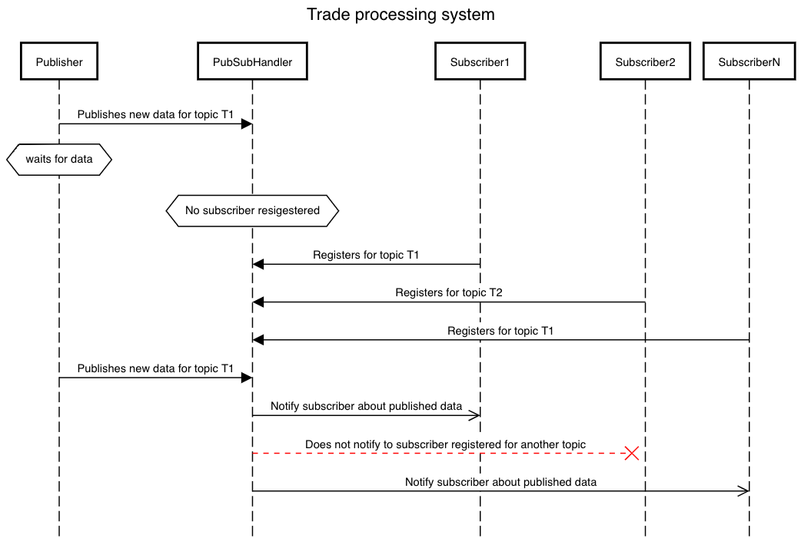

# **Fixed Income Trade Processing**

### Description:
This java project is created to process stream of trades published by Publisher.

### Design pattern:
Publisher Subscriber pattern

### Sequence Diagram:

### Checking the Functionality:

##### By Running Main Application:
Run Application.java

##### By Running test cases:
To Test the functionality or to check the calculation we can run the test cases(groovy file).
We have used spock groovy framework for the same. Each groovy file represents separate calculation of subscriber.

### Assumptions:
* No database been considered hence we are storing the processed in collection(list).

### Future Enhancement:
* Use Database for storing the Trade data
* Failure and then resending the Trade data

### Alternate Approach:
We have tried implementing the same functionality by using Rx-Java Observables. 
Checkout branch `feature/rxjava-observables` to check.